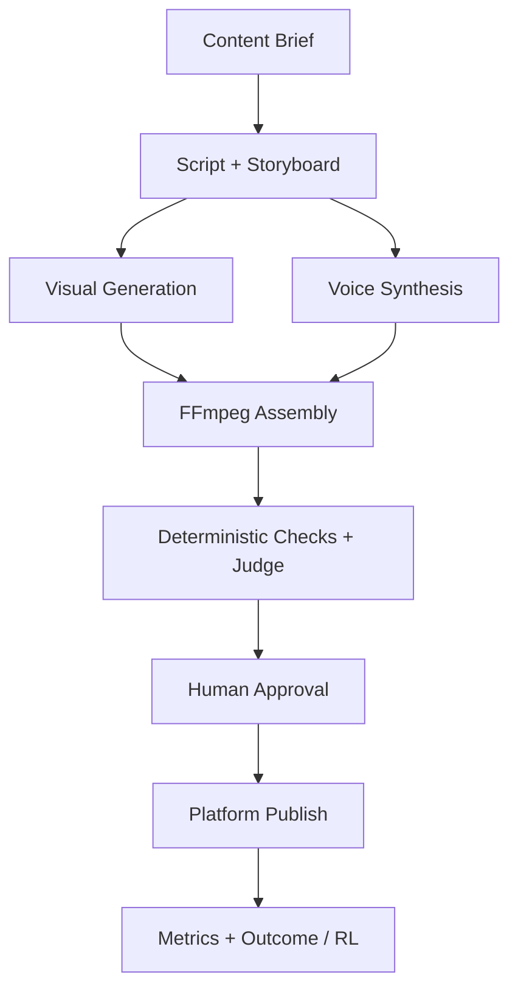

# Multimodal Content Creation Agent

**Multimodal Agent · Agent Runtime · Tool Use · Content Generation · Multimodal Evaluation**

面向短视频营销、品牌内容生产和多媒体创作场景的可恢复多模态内容生产系统。系统将内容目标拆解为脚本、分镜、视频素材、语音、合成、质量检查、人工审核和发布反馈等阶段，并把任务状态、工具执行、失败恢复与证据保存在模型之外。

> 当前状态：核心运行时、真实供应商适配器、持久化、质量门和任务 API 已完成代码实现与确定性测试。Runway、ElevenLabs、OpenAI Judge 与 TikTok 的凭据驱动端到端验证仍需在真实账号环境中完成；仓库不将模拟测试描述为生产部署。

## 系统边界

本项目解决的是长链路多模态生产的系统工程问题：

- 将创作目标转化为结构化脚本和可执行分镜；
- 统一调用视频生成、语音合成、FFmpeg 和对象存储工具；
- 在阶段之间持久化 Checkpoint，支持 Resume 和失败恢复；
- 用确定性媒体检查与可选多模态 Judge 阻断不完整结果；
- 在发布前保留 Human-in-the-loop 审核；
- 接收平台指标并写入 Outcome / RL 接口。

它不是一个“一次 Prompt 生成视频”的 Demo，也不声称已经完成无人值守的生产级自动发布。

## 执行流程



核心状态链：

```text
PENDING → RUNNING → WAITING_APPROVAL → COMPLETED
                    ↘ NEEDS_REVISION
RUNNING → FAILED / CANCELLED
```

## 已实现能力

### Agent Runtime

- 固定阶段的长程任务编排；
- 每阶段 Checkpoint 与按 `job_id` 恢复；
- 有界并行的镜头生成；
- 仅对明确的瞬时错误执行指数退避重试；
- 同一任务的进程内执行互斥；
- 取消、质量门、人工审核和发布前保护；
- 发布尝试标记，阻止网络结果不明时自动重复发布。

核心实现：

- `backend/app/engine/agents/workflow/multimodal_content_workflow.py`
- `backend/app/engine/agents/workflow/multimodal_service.py`
- `backend/app/engine/agents/workflow/multimodal_persistence.py`

### 多模态工具链

- 结构化 LLM 脚本与分镜规划；
- Runway 异步视频生成适配器；
- ElevenLabs TTS 适配器；
- FFmpeg 竖屏视频合成；
- SRT 字幕与可配置品牌模板；
- MinIO / S3 兼容素材持久化和重新物化。

核心实现：

- `backend/app/engine/agents/workflow/multimodal_content_adapters.py`
- `backend/app/engine/agents/workflow/multimodal_media.py`
- `backend/app/engine/agents/workflow/multimodal_artifacts.py`

### Evaluation

- 脚本完整性检查；
- 分镜与素材覆盖率检查；
- ffprobe 视频流、音频流和时长检查；
- 可选的抽帧 OpenAI 多模态 Judge；
- 确定性硬失败不能被模型评分覆盖。

核心实现：`backend/app/engine/agents/workflow/multimodal_eval.py`。

### API 与反馈

任务 API 支持：

- 提交、状态查询、审核、取消和恢复；
- TikTok 显式发布与发布状态查询；
- 已发布视频 ID 绑定后的指标回收；
- Outcome 持久化及幂等 RL 同步保护。

核心实现：

- `backend/app/api/v1/api_multimodal_production.py`
- `backend/app/engine/agents/workflow/multimodal_publishers.py`
- `backend/app/ml/rl/outcome_reward_bridge.py`

## 可靠性设计

| 风险 | 当前控制 |
| --- | --- |
| 中途失败导致全部重做 | 阶段级 Checkpoint，恢复时复用已完成结果 |
| 多镜头并行任务残留 | 首个失败后取消并回收同批任务 |
| 永久错误被重复收费 | 仅重试显式瞬时错误 |
| 重复审核或取消后发布 | 只有 `WAITING_APPROVAL` 状态可批准 |
| 网络超时导致重复发布 | 发布尝试持久标记，结果不明时要求先对账 |
| 节点本地文件丢失 | 从 MinIO / S3 重新物化后再评测 |
| 路径清洗碰撞 | 清洗结果附加原始值哈希 |
| 反馈污染其他任务 | trace 所有权、任务 post ID 绑定和 RL 幂等检查 |

## 验证状态

| 层级 | 状态 | 说明 |
| --- | --- | --- |
| P0 代码质量与确定性测试 | 已完成 | 多模态测试、Lint、Docker 与运维检查由 CI 执行 |
| P1 真实视频生成与 TTS | 待凭据验证 | 需要 Runway 与 ElevenLabs 账号密钥 |
| P2 持久化与恢复 | 部分完成 | 真实 MinIO 删除/恢复路径已验证；在线 Judge 仍需 OpenAI 凭据 |
| P3 发布与指标回流 | 待凭据验证 | 需要 TikTok 开发者应用、OAuth Scope 和真实发布授权 |

详细证据与阻塞项见 [`docs/PRODUCTION_HARDENING_STATUS.md`](docs/PRODUCTION_HARDENING_STATUS.md)。

## 当前限制

- 主流程是固定、可审计的生产状态机，尚未实现由 Judge 自动触发的开放式重规划循环；
- 活跃任务仍由 API 进程中的 `asyncio` 执行，标准 Compose 暂时固定为单 API worker；跨进程自动接管需迁移到分布式 Worker / Queue；
- TikTok 发布是显式 API 操作，不在默认任务链中静默触发；
- 第三方真实调用会产生成本，Live Workflow 默认不自动运行；
- 没有真实凭据和平台返回证据时，只能声明“代码实现和确定性验证完成”。

## 本地验证

```bash
cd backend
pip install -r requirements.txt
pip install -r requirements-test.txt
pytest tests/test_workflow/test_multimodal_*.py -q
```

运行服务前，从 `.env.example` 配置数据库、对象存储和供应商变量。真实媒体验证必须显式提供：

```text
RUNWAYML_API_SECRET
ELEVENLABS_API_KEY
ELEVENLABS_VOICE_ID
OPENAI_API_KEY          # 仅启用在线 Judge 时需要
TIKTOK_ACCESS_TOKEN     # 仅真实发布/指标回收时需要
```

## 项目迁移

本仓库由原 **Agentic Content Optimizer / Growth Flywheel** 升级而来，保留原 Git 历史。旧内容优化实验作为历史参考保存在 `legacy-growth-optimizer-v1` 分支，不再作为当前项目的能力或业务效果证明。

`haole-mas`、`reward-modeling-lab`、`RewardLens` 等项目保持独立：本仓库只使用与多模态生产直接相关的接口或设计，不复制其他旗舰仓库。

## 文档

- [`docs/MULTIMODAL_CONTENT_AGENT.md`](docs/MULTIMODAL_CONTENT_AGENT.md)：架构与恢复语义
- [`docs/PRODUCTION_HARDENING_STATUS.md`](docs/PRODUCTION_HARDENING_STATUS.md)：验证状态和证据边界
- [`docs/LIVE_VALIDATION_TRIGGER.md`](docs/LIVE_VALIDATION_TRIGGER.md)：付费/凭据驱动验证说明
- [`docs/INDEX.md`](docs/INDEX.md)：文档索引

## License

本项目沿用仓库现有许可证；第三方模型、平台 API 和生成内容同时受各供应商条款约束。
